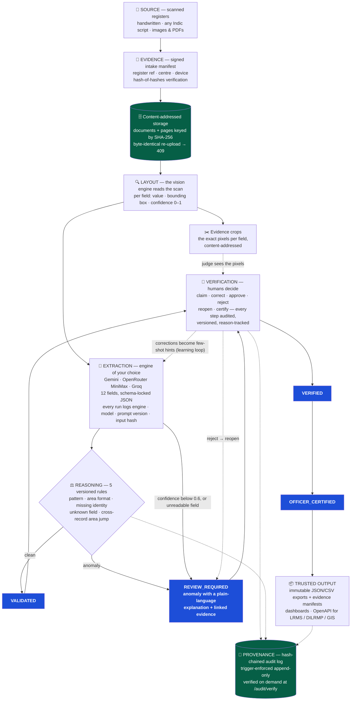

# BhuKosh — SIH26018

Intelligent Land Record Digitization & Validation System (Smart India Hackathon 2026, Ministry of Rural Development).

BhuKosh turns scans of handwritten land registers — in any Indian script — into validated digital records.
Every value the AI extracts stays bound to its evidence: click any field to see the exact pixels it was read
from, the engine run that produced it, and the human decisions behind it, all on a tamper-evident audit chain.
Business rules catch impossible data — area jumps, missing owners, unreadable fields — before a human ever
reviews, and every human correction teaches the extractor not to repeat the mistake. And it never asks you
to trust the AI: every record carries a **truth-assurance verdict** computed from independently checkable
signals — not from the model's opinion. To see it in 60 seconds: log in at the app link below as
`checker` / `checker-dev`, open a pending record, and click **Evidence** — then **Check assurance**.

**Live:** app → https://bhukosh.vercel.app · API → https://bhukosh-api.vercel.app · API docs (OpenAPI) → https://bhukosh-api.vercel.app/docs

---

## Why BhuKosh is different

Most digitization demos stop at "the AI read the text." BhuKosh is built for the part governments actually
care about: **can you trust it, and can you prove it?**

1. **Evidence-bound AI.** An extraction run's input hash is the SHA-256 of the exact bytes sent to the model.
   Replay any value: candidate → run (engine, prompt version, input hash) → document/page (hashes, sequence)
   → and for vision runs, the cropped pixels the value was read from.
2. **Validation before humans.** Five deterministic, versioned business rules run on every record; only
   anomalies (with plain-language explanations) reach a reviewer. Uncertain fields (engine-reported confidence
   < 0.6, or unreadable) route the record to review automatically — they never enter the database silently.
3. **Two scores, honestly separated.** *Reading confidence* (per field, and document-level as the worst field,
   color-banded) answers "did we read the pixels right?" **Truth assurance** (`GET /records/{id}/verify`)
   answers the harder question — "why believe it's *correct*?" — with a SUFFICIENT / PARTIAL / INSUFFICIENT
   verdict computed from independently checkable signals: rule outcomes, cross-record corroboration (other
   records for the same village+khasra agreeing on area), document integrity, and human authority. A
   VERIFIED record can still fail honestly when evidence contradicts it; the external LRMS/DILRMP cross-check
   is an explicit adapter slot, never faked.
4. **Tamper-evident provenance.** The audit trail is a hash chain enforced by database triggers (appends serialize on a Postgres advisory lock, so concurrent actions can never fork it) — rows cannot
   be edited or deleted, and `/audit/verify` re-checks the whole chain. Exports are immutable snapshots with
   an evidence manifest (document hashes, rulebook version, full decision trail).
5. **A real workflow, not a form.** Claim locks (HTTP 423), optimistic versioning (HTTP 409), mandatory
   reasons for rejections/corrections/reopens, and one audited write path for every human decision.
6. **It learns from its reviewers.** Human corrections are injected as few-shot guidance into future
   extraction prompts — and the loop is inspectable at `GET /learning/hints` (see the exact lessons the
   engine currently carries, and the decision trail behind each one).
7. **Multilingual end to end.** The engine reads any Indic script (verified live on Devanagari khatauni
   registers and Gujarati VF-6 forms), the interface itself runs in EN / हिन्दी / ગુજરાતી, and extracted
   values can be rendered into all three languages on demand — original script always preserved as evidence.
8. **Runs anywhere.** Identical code against a local offline Postgres (courts/tahsils with no internet) or
   a cloud deployment (Supabase + Vercel) — selected by one environment variable.

## How it works — the pipeline



Solid arrows are the happy path; dotted arrows are the guarantees that make it
trustworthy — evidence for the reviewer, feedback for the engine, and an
append-only audit trail around every decision. The stage-by-stage detail:

| Stage | What actually happens | Where it lives |
|---|---|---|
| SOURCE | Scanned pages enter through a **signed intake manifest** (register ref, centre, device, expected count, per-page SHA-256 hash-of-hashes verification). | `intake_manifests` |
| EVIDENCE | Documents are stored **content-addressed by SHA-256** — byte-identical re-uploads deduplicate (HTTP 409). Pages are registered with sequence + hashes. | `documents`, `pages` |
| LAYOUT | The vision engine (Gemini or OpenRouter) reads the scan and returns, per field: the value, a **bounding box** (0–1000 normalized), and a **confidence score**. Each box is cut from the scan (with padding) into a content-addressed **evidence crop**. | `evidence_crops`, `candidates.crop_id` |
| EXTRACTION | 12 land-record fields extracted per page (see Features). Raw engine output is preserved verbatim in storage; the run records engine, model, prompt id + version, input hash, status, and timings. | `processing_runs`, `candidates`, `api_usage` |
| REASONING | Versioned deterministic rules validate the extraction: pattern sanity, area-format convention, missing identity, unreadable fields, and cross-record area jumps. Failures create **anomalies with plain-language explanations**. | `validation_results`, `anomalies` |
| VERIFICATION | Records project into a strict state machine. Humans claim, approve, correct, reject, reopen, and certify — every step is a versioned, reason-tracked, hash-chained decision. | `land_records`, `field_values`, `human_decisions` |
| PROVENANCE | Every decision emits an audit event in the same transaction; the chain is append-only by trigger and verifiable on demand. Exports freeze record + evidence manifest. | `audit_events`, `exports` |
| TRUSTED OUTPUT | Certified records, immutable JSON/CSV exports with evidence manifests, OpenAPI for downstream LRMS/DILRMP consumption, dashboards for oversight. | `/exports`, `/stats` |

## Features

**Multilingual interface (EN / हिन्दी / ગુજરાતી)**
- One-click language switcher in the sidebar (and on the login page); choice persists per user via
  localStorage; `<html lang>` updates for accessibility and screen readers
- English and Hindi are fully translated (≈220 strings — every screen); Gujarati covers the core
  surfaces with automatic English fallback for the rest (add a key to the `gu` dict in
  `frontend/src/i18n.jsx` to translate it — no other change needed)
- Zero dependencies: hand-rolled provider + `useI18n()` hook, `{placeholder}` interpolation,
  per-language Indic font stack and line-height in CSS
- Note the distinction: the *interface* is trilingual; the *extraction engine* is script-agnostic
  (any Indic script in, structured values out — see below)
- **Multilingual output of the scanned values** (`POST /records/{id}/translate`, migration 011): one
  AI pass renders every extracted value into EN/HI/GU (names transliterated, never translated;
  numbers script-neutral), stored per field in `field_values.translations` — the original value is
  never modified, and human corrections wipe stale renderings. The record page shows the rendering
  in the operator's UI language beneath the original (evidence) value

**Multi-engine, engine-agnostic AI (`GET /engines`)**
- Uploaders pick the engine **per job** from cards that state each engine's honest strengths and
  limitations (e.g. "vision capable" vs "text mode only") — BhuKosh is not married to one AI provider,
  which is exactly what a government deployment wants (plug in whichever model your state's data centre hosts)
- Three engines ship: **Google Gemini** (primary — best free accuracy on handwritten Indic scripts,
  vision + text), **OpenRouter MiniMax-M3 :free** (independent quota, vision + text), **Groq qwen**
  (fastest text path; vision disabled on its free tier — labeled in the UI)
- Every run still records `engine_name` + `engine_version` in the evidence chain, so any value traces
  to exactly which AI read it; a 429 storm on one provider never blocks extraction — switch engines and continue
- Engines implement one structured-output contract (`app/engines.py`); keys are server-held only,
  availability is reported live in the catalog

**AI extraction (12 fields, any Indic script)**
- Core fields gate workflow routing: `khasra_no`, `owner_name`, `area_raw`, `village`
- Extended fields captured when the document carries them: `khata_no`, `survey_no`, `tehsil`, `district`,
  `land_classification`, `ownership_type`, `mutation_ref`, `registration_ref`
- Two paths: **vision** (the stored scan itself is the engine input — images on any engine, scanned
  PDFs on Gemini, which reads them natively) and **text** (pasted register lines, fast path)
- Schema-locked structured output; per-field **confidence 0–1**; core field < 0.6 or unreadable → review
- **Document-level confidence** on every record: the *worst* field score (a record is as trustworthy as its
  weakest reading), color-banded ≥85 / ≥60 / <60 in the records list and record header; human-corrected
  fields drop out; records without scores show honestly empty
- Prompt versions are a ledger: every run records the exact prompt version that produced it

**Validation & anomalies**
- `R-KHASRA-PATTERN` (warn) · `R-AREA-FORMAT` (warn, २-४० = 2.40 bigha convention) · `R-VILLAGE-MISSING` (info)
- `R-UNKNOWN-FIELD` (error, unreadable core field) · `R-AREA-JUMP` (error, cross-record area jump > 25% for
  the same village + khasra — catches misreads and flags suspicious mutations)
- Anomaly explanations are plain language with linked evidence records; open errors hold the record at review;
  stale findings auto-resolve on re-validation (audited)
- **Truth assurance** (`GET /records/{id}/verify`): composite SUFFICIENT / PARTIAL / INSUFFICIENT verdict over
  every checkable signal — business rules, cross-record corroboration against the database (same village +
  khasra must agree on area), document integrity, human authority — with per-check detail lines; the
  external-registry cross-check renders as an honest "adapter slot" rather than a fake lookup

**Human review workflow**
- States: `INGESTED → EXTRACTED → VALIDATED → REVIEW_REQUIRED → VERIFIED → OFFICER_CERTIFIED → ARCHIVED`,
  plus `REJECTED` / `QUARANTINED` exits and `REOPEN` back to review
- Claim/release with 15-minute locks; optimistic versioning; corrections update the field and keep the full
  before/after trail; certifier sign-off is a distinct, gated step

**Records search, sort & history (migration 010)**
- **Search** (`GET /records?search=…`): one term matches record ID (prefix — "14" finds #145), village,
  khasra, and every extracted field value (owner, survey, tehsil, district…). Executed entirely in
  Postgres on **pg_trgm GIN indexes** with similarity ranking — spontaneous, per-keystroke fast;
  graceful fallback when the extension is unavailable
- **Sort** (`sort_by`): id · village · khasra · state · version · updated · created · claim ·
  **confidence** (scored first, best first) · **relevance** (similarity when searching) — with `order=asc|desc`
- **Past vs current** (`GET /records/{id}/history`): the complete versioned story of a record — current
  field values (what an export would contain) beside every decision that ever changed a value or state
  (before → after, who, when, why), read from the append-only `human_decisions` table; current values
  are a projection of this history, never an independent edit

**Document integrity — duplicate & forged-scan detection (migration 010)**
- **Perceptual duplicates**: every page carries a 64-bit perceptual hash (dHash); at check time each
  page is compared against all other pages — ≤ 6 bits different = near-match, catching re-scans and
  re-uploads that differ at the byte level (byte-identical uploads are already 409'd at intake)
- **Vision forensics** (`POST /documents/{id}/integrity-vision`): a Gemini pass per page reports tamper
  signals (inconsistent erasure, mismatched fonts, spliced regions, print-vs-handwriting anomalies) and
  a verdict per page — CLEAN / SUSPECT / LIKELY_FORGED — stored as findings, explicitly labeled
  *decision support only; a human reviewer decides*
- **Learned identifier library** (`doc_identifiers`): stamps, seals, signatures and logos are learned
  from **VERIFIED+ records only** (`POST /integrity/learn/{page_id}`) — the AI learns what genuine
  documents look like from the corpus humans already certified, then future vision passes report
  IDENTIFIER_MATCH / IDENTIFIER_MISSING against that library

**Evidence & audit**
- `GET /fields/{id}/replay` — the complete chain behind any displayed value, including the visual crop
- `GET /crops/{id}/image` — the exact pixels, JWT-required
- **Record document viewer**: every record page shows its source scan pinned top-right — sticky while
  scrolling, one-click fullscreen expand, multi-document tabs with SHA-256 identity; fields the vision
  engine read are **highlighted at their exact pixels** (boxes computed from stored evidence-crop bboxes),
  and clicking a box or a value links the two
- Hash-chained audit log (trigger-enforced append-only), chain head + full-chain verification endpoints
- Learning loop: corrections → few-shot extraction guidance (`GET /learning/hints`)

**Dashboards & exports**
- `GET /stats` + Dashboard UI: records by state, accuracy proxy (1 − correction rate), pending review,
  open anomalies by rule, engine run stats (counts, avg duration), district/village progress
- Immutable JSON/CSV exports with evidence manifests; OpenAPI schema for government integrations

## Roles & permissions (RBAC)

Every endpoint is gated on a JWT plus a **live permission matrix** — a `role_permissions` table the
admin can edit at runtime from the Admin console (no redeploy). The seeded matrix matches the classic
five-role model below; toggles take effect within seconds and every change is audited.

| Capability | operator | checker | certifier | auditor | admin |
|---|:-:|:-:|:-:|:-:|:-:|
| Intake, upload, page registration | ✓ | ✓ | ✓ | | ✓ |
| Extraction (text + vision) | ✓ | ✓ | ✓ | | ✓ |
| Project run → record, validate | ✓ | ✓ | ✓ | | ✓ |
| Claim / release / approve / reject / correct / resolve anomalies | | ✓ | ✓ | | ✓ |
| Reopen REJECTED records | | ✓ | ✓ | | ✓ |
| **Reopen VERIFIED / OFFICER_CERTIFIED records** | | | | | **admin only** |
| CERTIFY (final officer sign-off) | | | ✓ | | ✓ |
| Read records, evidence, audit chain, dashboards, exports | ✓ | ✓ | ✓ | ✓ | ✓ |
| Download exports | ✓ | ✓ | ✓ | ✓ | ✓ |
| Create users · reset any password · change roles · (de)activate accounts | | | | | ✓ |
| Edit the permission matrix · force-release stuck claims | | | | | ✓ |

**Admin governance** (`/admin/*`, all audited): user CRUD with scrypt-hashed password resets,
role changes (self-demotion blocked), account (de)activation, per-role permission toggles with an
overlap hint (granting a permission another role already holds tells you *which*), and
force-release of stuck review claims. Admin always retains every permission — the platform's
last-resort authority cannot lock itself out.

Seeded dev users (demo — see caveats): `admin/bhukosh-admin`, `operator/operator-dev`,
`checker/checker-dev`, `certifier/certifier-dev`, `auditor/auditor-dev`.

## API reference

All endpoints are JWT-authenticated except `/health`. Interactive docs: `/docs` on the API.

| Area | Endpoints |
|---|---|
| Auth | `POST /auth/login` · `POST /auth/refresh` · `GET /auth/me` |
| Custody (source of truth for scans) | `POST /intake` · `GET /intake/{id}` · `POST /documents` · `GET /documents/{id}` · `POST /documents/{id}/pages` · `GET /documents/{id}/content` |
| Extraction | `POST /extract` (text prototype) · `POST /documents/{id}/extract` (evidence-bound text, `?engine=`) · `POST /pages/{id}/extract-image` (vision, `?engine=`) · `GET /engines` (catalog) · `GET /extraction/runs/{id}` · `GET /documents/{id}/runs` |
| Evidence | `GET /fields/{id}/replay` · `GET /crops/{id}/image` |
| Records & workflow | `GET /records` (`?search=&sort_by=&order=&limit=`) · `GET /records/{id}` · `GET /records/{id}/history` (past vs current) · `GET /records/{id}/documents` (source files) · `POST /records/from-run/{id}` · `POST /records/{id}/claim` · `POST /records/{id}/release` · `POST /records/{id}/decisions` (approve/reject/certify/reopen/correct) · `POST /records/{id}/validate` · `GET /records/{id}/validation` · `GET /records/{id}/verify` (truth assurance) · `POST /records/{id}/translate` (multilingual output) |
| Document integrity | `POST /documents/{id}/integrity-check` (perceptual duplicates) · `POST /documents/{id}/integrity-vision` (forensic pass) · `GET /documents/{id}/integrity` (stored findings) · `POST /integrity/learn/{page_id}` (learn identifiers from VERIFIED records) |
| Anomalies | `GET /anomalies` · `GET /anomalies/{id}` · `POST /anomalies/{id}/resolve` |
| Audit | `GET /audit/events` · `GET /audit/chain-head` · `GET /audit/verify` |
| Admin | `GET/POST /admin/users` · `POST /admin/users/{u}/password` · `POST /admin/users/{u}/role` · `POST /admin/users/{u}/active` · `GET /admin/permissions` · `GET /admin/permissions/{p}/overlap` · `POST /admin/permissions/{role}/{p}` · `POST /admin/records/{id}/force-release` |
| Exports | `POST /records/{id}/exports` · `GET /exports` · `GET /exports/{id}/download` |
| Insights | `GET /stats` · `GET /learning/hints` |
| Ops | `GET /health` |

Extraction is rate-limited per user (sliding window, default 5/min) and every engine call is logged to
`api_usage`. All engine keys live only on the server — clients never see them.

## Architecture & services

```
Browser (React/Vite SPA, same-origin /api)
   │
   ├─ Vercel (frontend project, bhukosh.vercel.app)      ── rewrites /api/* ──┐
   ├─ Vercel (Python serverless, bhukosh-api.vercel.app) ◄────────────────────┘
   │     └─ FastAPI app (this repo, backend/)
   │
   ├─ Supabase Postgres (transaction pooler :6543, sslmode=require)   ← all 19 tables
   ├─ Supabase Storage (private `bhukosh` bucket)                     ← scan bytes + crops + raw outputs
   └─ AI engines (server-held keys, `app/engines.py` registry)   ← vision + text extraction
         ├─ Google Gemini (gemini-3.7-flash)         — primary
         ├─ OpenRouter (minimax-m3:free)             — vision + text, independent quota
         └─ Groq (qwen text)                         — fastest text path
```

- **Database (current):** Supabase Postgres in production — dedicated app role, transaction pooler, TLS.
  **Offline mode:** a portable local PostgreSQL 16 cluster (`infra/pgdata`) driven by `PG_*` vars — same
  migrations, same seed scripts, zero internet needed. `DATABASE_URL` set vs empty picks the mode.
- **Object storage:** Supabase Storage (private bucket) in production; local `data/` directory offline.
  `app/storage.py` auto-selects (`STORAGE_BACKEND=auto`). Everything is content-addressed by SHA-256.
- **AI engines (multi-engine registry):** all engines implement one structured-output contract.
  **Google Gemini** (`gemini-3.7-flash`) — primary, schema-locked JSON, temperature 0, transient
  429/503 retried with backoff. **OpenRouter** (`minimax/minimax-m3:free`) — independent quota,
  vision + text, chosen by bake-off (below). **Groq** (`qwen` text models) — fastest text path;
  its free tier has no vision models, so the UI labels it "text mode only". Engine failures mark the
  run FAILED with a sanitized error; every call is logged to `api_usage` with engine + model recorded.
- **The engine bake-off** (how the lineup was chosen): OpenRouter's live catalog was scanned for free
  vision-capable models (11 found) and the top candidates were tested against a real Gujarati
  inheritance-form scan (`VF-6`). MiniMax-M3 :free read the scan correctly in ~4 s; Gemma free models
  were quota-saturated upstream; other free models lacked image input or an open endpoint. On Groq,
  Llama-4-scout (its former vision model) is retired, leaving text-only qwen — verified extracting
  structured Hindi text in ~3.6 s. Gemini remains primary for handwritten Indic accuracy.
- **Data model:** 19 tables across 11 migrations — users, api_usage, intake_manifests, documents, pages,
  evidence_crops, processing_runs, candidates, land_records, field_values, human_decisions, anomalies,
  validation_results, audit_events, exports, role_permissions, permission_catalog, doc_identifiers,
  integrity_findings.
- **Deployment:** push to `master` → both Vercel projects build and deploy automatically (Root Directories
  `backend/` and `frontend/`). Secrets live in Vercel's encrypted store; nothing sensitive is in the repo.

## Quickstart (dev)

```bash
# 1. Backend deps
cd backend
python -m venv .venv
.venv\Scripts\pip install -r requirements.txt     # Git Bash: .venv/Scripts/pip install -r requirements.txt

# 2. Local Postgres (portable, already initialized under infra/pgdata)
scripts/pg_start.bat          # or: infra/pg16/pgsql/bin/pg_ctl -D infra/pgdata -l logs/pg.log start

# 3. Migrations + seed dev users
cd backend && .venv/Scripts/python -m scripts.db_migrate && .venv/Scripts/python -m scripts.seed_users

# 4. Run API
.venv/Scripts/python -m uvicorn app.main:app --reload --port 8000
```

Tests: `cd backend && .venv/Scripts/python -m pytest -q` (stubbed engine — no API quota burned).

Demo data (8 records across pipeline states, incl. a live area-jump anomaly pair — works against local or
the production API): `cd backend && .venv/Scripts/python -m scripts.seed_demo [BASE_URL]`

Health checks: `python -m scripts.check_db` · `python -m scripts.check_gemini` · engine probe: `python -m scripts.probe_extract`

### Frontend (dev)

```bash
cd frontend
npm install
npm run dev        # http://localhost:5173 — proxies /api to the backend on :8000
npm run build      # production bundle in dist/
```

## Environment

`.env.example` documents every key; copy to `.env` and fill in. `.env` is gitignored.

| Key | Purpose |
|---|---|
| `DATABASE_URL` | Supabase Postgres URI (pooler :6543). Empty → local mode via `PG_*` |
| `PGHOST/PGPORT/PGDATABASE/PGUSER/PGPASSWORD` | Local Postgres connection |
| `JWT_SECRET`, `JWT_ALG`, `ACCESS_TOKEN_MINUTES`, `REFRESH_TOKEN_DAYS` | Auth |
| `GEMINI_API_KEY`, `GEMINI_MODEL` | Primary AI engine (default `gemini-3.7-flash`) |
| `OPENROUTER_API_KEY`, `OPENROUTER_VISION_MODEL`, `OPENROUTER_TEXT_MODEL` | Second engine (default MiniMax-M3 :free) |
| `GROQ_API_KEY`, `GROQ_TEXT_MODEL` | Third engine — text path only (free tier has no vision) |
| `EXTRACT_RATE_LIMIT_*` | Per-user extraction quota |
| `SUPABASE_URL`, `SUPABASE_SERVICE_KEY`, `STORAGE_BACKEND` | Object storage (auto by default) |
| `APP_NAME`, `ENV`, `HOST`, `PORT` | Basics |

## Project layout

```
sih26018/
├── backend/
│   ├── api/index.py            # Vercel serverless entrypoint
│   ├── app/                    # the FastAPI application
│   │   ├── auth/               #   login, refresh, RBAC dependencies
│   │   ├── custody/            #   intake manifests, documents, pages (chain of custody)
│   │   ├── processing/         #   extraction runs + vision path + evidence crops
│   │   ├── extract/            #   Gemini client, schemas, prompt ledger, rate limit
│   │   ├── engines.py          #   multi-engine registry: Gemini / OpenRouter / Groq
│   │   ├── integrity.py        #   duplicate + forged-scan detection, identifier learning
│   │   ├── i18n_output.py      #   multilingual rendering of extracted values
│   │   ├── verification.py     #   truth-assurance verdict engine (+ router)
│   │   ├── records/            #   land_records state machine + decisions + search/history
│   │   ├── rules/              #   validation registry + anomaly service
│   │   ├── evidence.py         #   /fields/{id}/replay provenance chain
│   │   ├── audit/              #   hash-chained audit events + verification
│   │   ├── exports/            #   immutable JSON/CSV snapshots + manifests
│   │   ├── stats/              #   /stats dashboard aggregation
│   │   ├── learning/           #   corrections → extraction hints (PS #13)
│   │   ├── storage.py          #   Supabase Storage ↔ local disk, auto-selected
│   │   ├── config.py, db.py, errors.py
│   │   └── main.py             #   app assembly + /health
│   ├── scripts/                # db_migrate, seed_users, seed_demo, smoke_*, check_*, gen_secret
│   ├── tests/                  # pytest suite (stubbed engine — CI-safe, no quota)
│   └── requirements.txt
├── frontend/                   # React + Vite SPA
│   └── src/
│       ├── pages/              # Login, Dashboard, Records, RecordView, Upload, Audit, Admin
│       └── DocViewer.jsx …     # scan viewer with pixel highlights, crops, confidence chips
├── infra/
│   ├── migrations/             # 11 SQL migrations (the whole 19-table data model)
│   └── pgdata/                 # portable local Postgres cluster (offline mode)
└── scripts/pg_start.bat        # local PG helper
```

Every module maps to one pipeline stage — `custody` is SOURCE/EVIDENCE, `processing` is
LAYOUT/EXTRACTION, `rules` is REASONING, `records` is VERIFICATION, `audit` + `exports`
are PROVENANCE/TRUSTED OUTPUT — so the codebase reads the same way the pitch does.

## What to expect (honest caveats)

- **The seeded credentials are public** (they're in this repo on purpose, so judges can log in). Before any
  real deployment: rotate passwords, disable seed users, issue real ones.
- **Gemini quota is shared** across the free-tier key — heavy testing can hit 429s; the client retries with
  backoff and surfaces a sanitized problem if the engine is unavailable. Mitigation: switch engines from the
  upload page (OpenRouter/Groq have independent quotas).
- **Serverless cold starts**: the first request after idle takes a few seconds.
- **Prototype-level by design:** the learning loop is prompt-injection (few-shot), not fine-tuning;
  government-system integration is via the documented API + evidence-manifested exports (no direct LRMS
  adapters exist to test against); accuracy claims are demo-verified, not benchmarked.
- Extraction quality depends on scan legibility — that's exactly what the confidence scoring + review
  routing exists for.

## Roadmap

Review-queue ranking (priority by anomaly severity + confidence) · confidence calibration (observed
correction rates per band, validating the engine's self-report against real outcomes) · evaluation harness
with labeled benchmark sets · PWA install for field tablets · multi-page register batch intake · direct
LRMS/DILRMP + GIS adapters · fine-tuning on accumulated correction pairs · GIS overlay for khasra maps.
